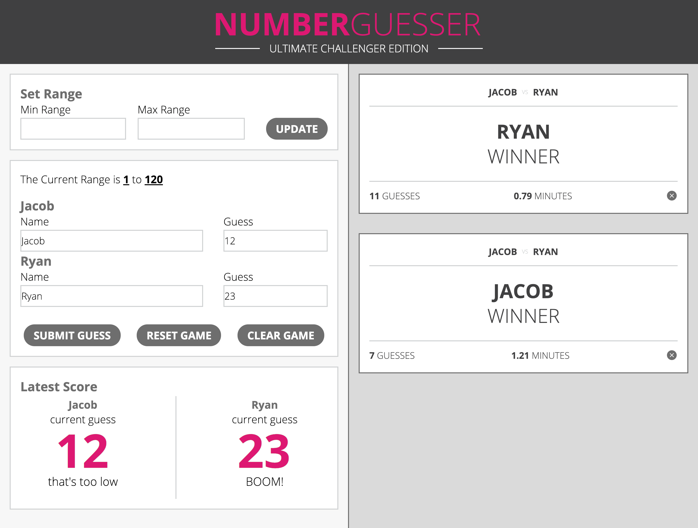

# Number Guesser

This is the first group project of the front end program at the [Turing School of Software and Design](https://https://turing.io/). The point of the project was to develop an interactive number guessing game with HTML, CSS, and JavaScript. The authors crafted a well structured, semantic HTML webpage and then used CSS to make the page fully responsive on all screen sizes. In addition to the HTML and CSS the authors utilized JavaScript to add, remove, and update elements on the DOM depending on the user's input. The end result is a dynamic number guessing game that is fun to play!

You can visit the live finished version of this project at ---.

## Key Features

* **Responsive** - The content looks good on any screen size
* **Flexbox** - Uses flexbox to make the layout fluid
* **Interactive** - Two Users can interact with the game with multiple input fields
* **Dynamic** - New content is added or removed from the game depending on the user's actions

## Built With

* [HTML](https://developer.mozilla.org/en-US/docs/Web/Guide/HTML/HTML5)
* [CSS](https://developer.mozilla.org/en-US/docs/Web/CSS)
* [JS](https://developer.mozilla.org/en-US/docs/Web/JavaScript)

## Authors

* **Jacob Bogart** - [Jacob's Github](https://github.com/jacobogart)
* **Ryan Barnett** - [Ryan's Github](http://github.com/RyanDBarnett)

## How The Website Should Appear On Desktop  

## How The Website Should Appear On Mobile

## Finished Project On Desktop

## Finished Project On Mobile

## License

This project is licensed under the MIT License - see the [LICENSE.md](LICENSE.md) file for details
